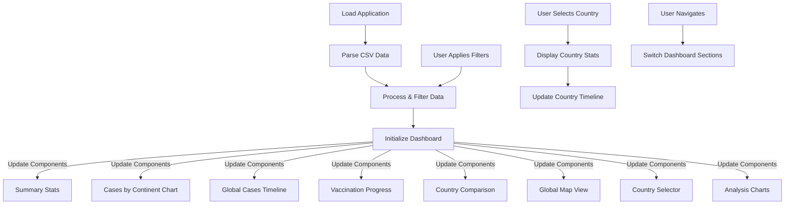

# COVID-19 Global Analysis Dashboard

**Live Demo:** [https://squizai.github.io/DA_covidHW/](https://squizai.github.io/DA_covidHW/)

**GitHub Repository:** [https://github.com/SquizAI/DA_covidHW](https://github.com/SquizAI/DA_covidHW)

## Overview

This interactive dashboard visualizes COVID-19 data from the Our World in Data dataset, providing comprehensive insights into the global pandemic. The application allows users to analyze the behavior of the virus by continent, location, and date through various interactive visualizations.

## Features

### Interactive Dashboard

The dashboard offers multiple interactive visualizations powered by Chart.js:

- **Cases by Continent**: Bar chart showing total COVID-19 cases across continents
- **Global Cases Timeline**: Line chart displaying the progression of new cases over time
- **Vaccination Progress**: Bar chart showing vaccination rates by continent
- **Country Comparison**: Horizontal bar chart comparing top countries by case numbers
- **Summary Statistics**: Key metrics (total cases, deaths, vaccinations, and case fatality rate) that update based on selected filters

### Filtering Capabilities

Users can filter the data by:
- Continent
- Country
- Date range (start and end dates)

All visualizations and statistics update dynamically based on the selected filters.

### Metadata Guide

The dashboard includes a comprehensive metadata guide that explains:
- Dataset structure and variables
- Data categories (geographic identifiers, case metrics, mortality metrics, etc.)
- Important considerations for data interpretation

### Analysis Section

In-depth analysis of the pandemic is provided through multiple lenses:
- **Continental Patterns**: How COVID-19 spread across different continents
- **Temporal Evolution**: Changes in the pandemic over time
- **Geographical Insights**: Location-specific factors affecting COVID-19 outcomes
- **Policy Impact Assessment**: Effectiveness of government interventions

## Technical Implementation

### Technologies Used

- **HTML/CSS**: Responsive frontend design
- **JavaScript**: Core application logic
- **Chart.js**: Data visualization library
- **PapaParse**: CSV parsing library
- **jQuery**: Used for DOM manipulation
- **jVectorMap**: World map visualization

### Application Flow

This flowchart illustrates how data flows through the application, from loading CSV data to updating various visualizations. It also shows how user interactions (applying filters or selecting countries) trigger updates throughout the dashboard.

### Code Structure

- **index.html**: Main application structure and UI elements
- **css/styles.css**: Styling for the dashboard
- **js/main.js**: Core application logic (data loading, filtering, UI updates)
- **js/charts.js**: Chart creation and visualization logic
- **metadata_summary.md**: Detailed explanation of the dataset

## Data Source

The dashboard uses the comprehensive COVID-19 dataset from Our World in Data, which compiles data from various official sources including the WHO, ECDC, and national health agencies.

## Usage

1. Clone or download the repository
2. Open index.html in a modern web browser
3. Use the filters to explore different aspects of the COVID-19 data
4. Navigate between dashboard, metadata, and analysis sections using the navigation menu

## Future Enhancements

- Additional predictive analytics and AI-based forecasting
- Extended regional trend analysis
- Export functionality for charts and data
- Offline data caching
- Vaccination effectiveness analysis
- Custom user dashboards and saved views
